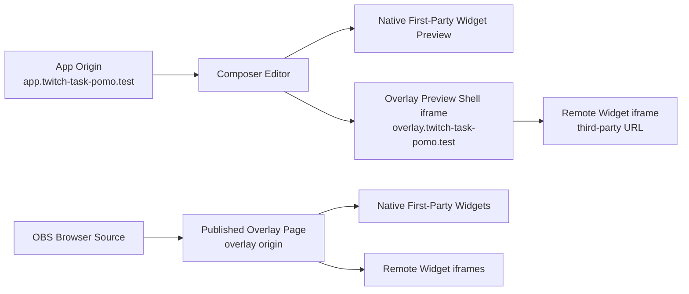

# 002 Overlay Origin And Widget Preview Architecture

## Purpose

Define the trusted-origin split, widget preview model, local Valet setup, and deployment shape for the composer before the current iframe-based editor surface hardens into a long-term constraint.

This note is intentionally implementation-ready. It records the target architecture, the environment and deployment changes required to support it, the code areas expected to change, and the acceptance criteria for the first full hardening pass.

## Status

Proposed and ready to implement.

The current implementation at `HEAD` still renders first-party and remote widget previews directly inside the authenticated editor surface. This document supersedes that direction.

## Problem Statement

The current composer implementation correctly proves the product interaction model:

- a canvas-dimension-driven workspace,
- persisted widget geometry and z-index,
- live preview while editing,
- remote widget support through HTTPS iframe URLs.

However, the trust boundary is too weak for the long term:

- first-party preview routes are same-origin iframes inside the authenticated app shell,
- remote widget URLs are user-supplied and currently render in the authenticated editor,
- the remote preview inspector performs server-side HTTP requests and therefore needs SSRF controls,
- the future OBS delivery surface should be lower-trust than the main app origin,
- the current sandbox configuration is too permissive for same-origin preview use.

For a greenfield product, this is the right point to split trusted editor concerns from low-trust render concerns.

## Research Inputs

These external references informed this plan:

- MDN documents that using both `allow-scripts` and `allow-same-origin` on a same-origin iframe effectively removes the safety value of the sandbox and recommends serving potentially malicious content from a separate origin.
- MDN documents that `frame-ancestors` is the primary browser control for which parent documents may embed a page.
- OBS documents Browser Source as a Chromium Embedded Framework browser surface that loads a top-level page URL directly and supports normal browser behavior within reason.

This leads to three durable conclusions:

- the publishable OBS surface should be a top-level signed page, not an iframe wrapper,
- iframe is still the correct primitive for arbitrary third-party web embeds,
- same-origin authenticated editor pages should not be the place where low-trust remote embeds run.

## Goals

- Preserve a strong live-preview workflow while editing.
- Separate trusted authenticated app pages from lower-trust overlay and remote embed surfaces.
- Keep first-party widgets pleasant to preview without paying the iframe penalty.
- Support OBS Browser Source with one signed publishable canvas URL.
- Make local Valet and later Nginx deployment explicit before implementation starts.
- Close the major foreseeable security gaps in one coherent pass instead of accumulating patchwork fixes.

## Non-Goals

- Solving all future widget-catalog governance.
- Building a screenshot service for third-party widgets.
- Introducing a second Laravel application.
- Supporting every possible third-party embed contract in the first pass.

## Decision Summary

### 1. Two Origins, One Application

The application will remain one Laravel codebase and one deployment artifact, but it will serve two distinct web origins:

- App origin:
  - Example local host: `app.twitch-task-pomo.test`
  - Purpose: authenticated dashboard, composer editor, team management, auth callbacks, local tooling
  - Trust level: high
- Overlay origin:
  - Example local host: `overlay.twitch-task-pomo.test`
  - Purpose: signed published canvas pages, low-trust preview shells, remote widget framing
  - Trust level: lower

The overlay origin is not a second product frontend. It is a constrained rendering surface owned by the same app.

### 2. First-Party Widgets Render Natively

Proprietary first-party widgets must stop using iframe previews in the editor.

Instead:

- the editor renders first-party widget previews natively inside the app origin,
- the published overlay page renders those same widgets natively on the overlay origin,
- shared renderer contracts must keep editor and runtime output visually aligned.

The first implementation should cover:

- task list,
- pomodoro,
- spotify now playing as part of the formal proprietary widget catalog.

### 3. Remote Widgets Stay iframe-Based, But Move Out Of The Trusted Editor

Arbitrary external web content should remain an iframe-based widget type.

However:

- the authenticated app origin must not load the remote URL directly,
- editor preview for remote widgets should load a low-trust preview shell from the overlay origin,
- that overlay preview shell may then embed the remote URL within a stricter sandbox and a constrained chrome,
- the publishable overlay page may also embed the remote URL from the overlay origin.

This preserves live preview without making the main app shell host untrusted third-party pages directly.

### 4. OBS Delivery Is A Top-Level Signed Page

The publishable canvas URL consumed by OBS should be a top-level signed page on the overlay origin.

Target shape:

- `https://overlay.example.com/overlay/{canvas_uuid}?signature=...`

OBS Browser Source loads a normal page URL directly. The canvas page is the top-level browser document. Widgets inside that page may be native renderers or remote iframes depending on widget type.

### 5. Preview Routes And Published Routes Have Different Framing Policies

Not all overlay-origin routes should have the same embedding policy.

- Published overlay routes:
  - intended for top-level loading in OBS and browser tabs
  - should default to `Content-Security-Policy: frame-ancestors 'none'`
- Editor preview shell routes:
  - intended to be embedded only by the app origin
  - should set `frame-ancestors {app origin}`

This keeps the published runtime out of arbitrary third-party frames while still allowing in-editor preview shells.

## Target Architecture



## Origin Rules

### App Origin

- Owns authentication, session cookies, CSRF, Livewire state, team-scoped CRUD, and editor interactions.
- Must never directly iframe arbitrary remote widget URLs.
- Should default to `frame-ancestors 'none'`.
- Should keep cookies host-only rather than sharing them across subdomains.

### Overlay Origin

- Must not depend on authenticated app session state to render signed public overlay content.
- May host preview shell routes and published overlay routes.
- Should avoid issuing auth cookies altogether for signed overlay paths.
- Should be treated as a low-trust document origin compared with the app origin.

## Rendering Model

### Proprietary Widgets

Proprietary widgets should render through signed overlay-origin widget pages, not inline in the authenticated editor.

Implementation shape:

- add a support layer that resolves a canvas widget placement to a signed overlay widget URL,
- serve first-party widgets from dedicated overlay widget page views,
- point both the editor preview and the published overlay canvas at those same overlay-origin widget pages,
- keep widget content driven by normalized widget settings so the same data contract feeds editor and runtime.

This keeps preview and runtime behavior on a single rendering plane while preserving the app-origin versus overlay-origin trust split.

### Remote Widgets

Remote widget editor preview should use a dedicated overlay-origin preview shell route:

- App editor embeds:
  - `https://overlay.../overlay/widgets/{canvas_widget_id}?signature=...`
- Preview shell then embeds the remote widget URL.

The preview shell responsibilities:

- size and clip the remote widget to the persisted geometry,
- display advisory state when runtime load is slow or fails,
- provide no authenticated app shell,
- emit lightweight status messages back to the parent editor only via explicit `postMessage`,
- avoid any privileged bridge beyond preview lifecycle events.

The app editor responsibilities:

- show the remote widget preview as a box on the canvas,
- consume preview lifecycle messages,
- never pass privileged user state into the preview shell.

## Sandbox And Permissions Policy

### Proprietary Widgets

Proprietary widget iframes should use the same low-privilege sandbox posture as remote previews unless a concrete first-party requirement forces a broader capability set.

First implementation target:

- `sandbox="allow-scripts"`
- no `allow-same-origin`
- no `allow-forms`

### Remote Widgets

Remote widgets should use a stricter sandbox than the current implementation.

First implementation target:

- start from `sandbox="allow-scripts"`
- do not include `allow-same-origin` by default
- do not include `allow-forms` by default
- do not include top-navigation or popup permissions

If a concrete supported remote widget requires additional tokens, add them intentionally and document the use case.

This means some third-party embeds that rely on cookies, forms, or privileged storage access will not preview correctly. That is an acceptable tradeoff for the first secure implementation.

## URL Validation And SSRF Controls

The current `RemoteWidgetPreviewInspector` performs server-side requests. That means remote widget creation is also an SSRF surface and must be treated as such.

The first hardening pass must add all of the following:

- allow only `https://` URLs,
- reject app-origin URLs,
- reject overlay-origin URLs,
- reject localhost and loopback hosts,
- reject private, link-local, reserved, and unroutable IP ranges after DNS resolution,
- reject redirect chains that land on blocked hosts or blocked IP ranges,
- cap redirect depth,
- cap response size for any fallback `GET`,
- preserve timeout and retry limits,
- store the final checked host and checked timestamp for observability if useful.

This validation belongs in a shared remote-widget URL validator used by both the Livewire form and the action layer.

## Cookie, Session, And Auth Rules

- `SESSION_DOMAIN` should remain host-only in local and production by default.
- Do not broaden cookies to `.example.com` for convenience.
- The overlay origin must not rely on app-origin cookies to render signed overlay pages.
- Signed overlay routes should be stateless and authorize via signature plus canvas/team policy checks derived from the signed payload.
- If a future overlay-authoring workflow needs app-authenticated preview access, use signed short-lived tokens or preview-specific signed URLs rather than shared session cookies.

## Content Security Policy Plan

The first implementation pass should introduce route-family CSP instead of one monolithic global policy.

### App Origin Defaults

- `frame-ancestors 'none'`
- conservative `default-src`, `script-src`, `style-src`, `img-src`, `connect-src`, and `frame-src`
- `frame-src` should allow the overlay origin and only any other explicitly approved origins needed by product-owned pages

### Overlay Preview Shell Routes

- `frame-ancestors {app origin}`
- `frame-src https:`
- tighten `script-src`, `connect-src`, and `img-src` as much as practical
- add report-only support first if rollout risk is high

### Published Overlay Routes

- `frame-ancestors 'none'`
- `frame-src https:`
- no dependence on app shell assets that are not needed for rendering

## UX Requirements

### Composer Editor

- Built-in widgets must remain visibly live and dimensionally faithful on the canvas.
- Remote widgets should keep a live preview path when the remote site permits framing and the sandbox permits useful behavior.
- When preview is degraded, the editor should show why in plain English:
  - blocked by embed policy,
  - remote preview unavailable,
  - preview running with limited permissions,
  - slow runtime load,
  - open the preview in a new tab for verification.

### Widget Catalog And Creation Copy

Remote widget creation UI should explain:

- only HTTPS URLs are allowed,
- previews run with restricted permissions,
- some embeds may not function fully in-editor even when they render in top-level contexts,
- remote widget content is third-party content and may display account-specific state from that third party,
- app and overlay self-URLs are not accepted as remote widgets.

## Local Valet Plan

This project should move from one Valet host to two Valet hosts pointing at the same codebase.

### Required User Setup Before Implementation

Before the implementation branch is executed locally, the user should run:

```bash
cd /Users/mike/Projects/twitch-task-pomo
valet link app.twitch-task-pomo
valet secure app.twitch-task-pomo
valet link overlay.twitch-task-pomo
valet secure overlay.twitch-task-pomo
```

Notes:

- Laravel Valet supports linked subdomain-style site names and TLS-secured local hosts.
- If an older host such as `local.twitch-task-pomo.test` is still in use, either keep it temporarily for backward compatibility during migration or remove it once the new `.env` values are in place.
- The same project directory may back both links because the trust boundary is at the host and middleware/config level, not the filesystem level.

### Local Environment Shape

Target local URLs:

- app origin: `https://app.twitch-task-pomo.test`
- overlay origin: `https://overlay.twitch-task-pomo.test`

OAuth callback URLs should point at the app origin only.

## Environment Variables

`.env.example` should define the target split now so future implementation work does not need to invent configuration naming mid-stream.

Required variables:

- `APP_URL`
  - app origin
- `APP_OVERLAY_URL`
  - overlay origin
- `SESSION_DOMAIN`
  - remain `null` unless a future design intentionally requires shared cookies
- provider callback URLs
  - point to the app origin

Expected first config follow-up:

- expose `config('app.overlay_url')`
- add a small support helper for route generation that knows whether a URL belongs on the app or overlay origin

## Nginx Deployment Notes

Assume one codebase and one Laravel deployment served by two Nginx server blocks.

### Required Production Shape

- `app.example.com`
  - points to the Laravel app
  - serves authenticated app pages
- `overlay.example.com`
  - points to the same Laravel app
  - serves signed overlay and preview routes

### Recommended Nginx Properties

- separate `server_name` blocks for app and overlay origins
- TLS on both origins
- host preservation so Laravel can branch behavior by origin
- route-family response headers applied either in Laravel middleware or Nginx if static enough
- no broad cookie domain overrides at Nginx

### Deployment Guidance For README

The README should state:

- production requires two public HTTPS origins,
- app and overlay may share the same codebase and PHP-FPM pool,
- app callbacks and auth stay on the app origin,
- signed overlay delivery and preview shell routes stay on the overlay origin,
- wildcard or SAN certificates may be used if the operator prefers,
- cookie scope should remain host-only unless the security model is intentionally revisited.

## Planned Implementation Steps

### Step 1. Introduce Origin Config And Host Routing

Files likely involved:

- `.env.example`
- `config/app.php`
- route and URL generation helpers
- middleware to detect app origin vs overlay origin

Deliverables:

- `config('app.url')` remains the app origin
- `config('app.overlay_url')` exists
- route helpers can generate overlay-origin absolute URLs

### Step 2. Introduce Route Families For Published Overlay And Preview Shells

Files likely involved:

- `routes/web.php`
- new controller or invokable action classes for overlay rendering
- middleware for signature and CSP handling

Deliverables:

- top-level signed published canvas route on overlay origin
- signed preview shell route on overlay origin

### Step 3. Replace Proprietary Widget iframe Previews With Native Renderers

Files likely involved:

- `app/Support/Widgets/*`
- widget-definition registry and widget renderer support
- `resources/views/livewire/canvases/canvas-composer.blade.php`
- new renderer views under `resources/views/widgets/`

Deliverables:

- no iframe preview for task list and pomodoro in the editor
- no same-origin sandbox warning for proprietary widget previews

### Step 4. Move Remote Preview Into Overlay Preview Shell

Files likely involved:

- `app/Livewire/Canvases/CanvasComposer.php`
- `resources/views/livewire/canvases/canvas-composer.blade.php`
- new overlay preview shell view and JS messaging support

Deliverables:

- app origin no longer directly iframes user-supplied remote URLs
- runtime preview state still updates in the editor

### Step 5. Harden Remote URL Validation And Preview Inspection

Files likely involved:

- `app/Actions/WidgetInstances/CreateRemoteWidget.php`
- `app/Support/Widgets/RemoteWidgetPreviewInspector.php`
- new remote widget URL validator support class
- tests

Deliverables:

- SSRF-safe remote inspection
- same-origin and private-network rejection
- clear error messages in the form and persisted preview state

### Step 6. Add CSP And Header Policies

Files likely involved:

- middleware
- exception/reporting configuration if report-only rollout is used
- tests

Deliverables:

- app origin default `frame-ancestors 'none'`
- preview routes embeddable only by app origin
- published overlay routes top-level only

### Step 7. Update Browser And Feature Coverage

Tests should cover:

- proprietary widgets render natively in editor
- remote widgets preview through overlay-origin shell rather than direct remote iframe in app origin
- remote widget creation rejects app-origin, overlay-origin, loopback, and private-address targets
- signed overlay route loads on overlay origin
- CSP/frame behavior is asserted where practical
- browser coverage includes at least one first-party preview and one remote preview advisory path

## Acceptance Criteria

- The authenticated app origin no longer embeds arbitrary remote URLs directly.
- Proprietary widget previews no longer rely on same-origin iframes.
- OBS delivery uses a top-level signed overlay page on the overlay origin.
- Overlay preview shell routes are embeddable only by the app origin.
- Published overlay routes are not designed to be framed by arbitrary sites.
- Remote widget URL validation blocks self-origin and SSRF-prone targets.
- Local Valet setup and production deployment notes are documented and reproducible.

## Open Questions

- Whether the first hardening pass should allow any remote sandbox tokens beyond `allow-scripts`.
- Whether remote widgets should be available to all users immediately or hidden behind an explicit advanced feature gate.
- Whether published overlay routes should include a lightweight runtime diagnostics endpoint for support and QA.

## Recommendation

Implement this note before adding more remote-widget capability.

The current product direction is correct, but the trust boundary should be fixed now while the composer is still early and before signed overlay delivery and public beta work build on the existing assumptions.
